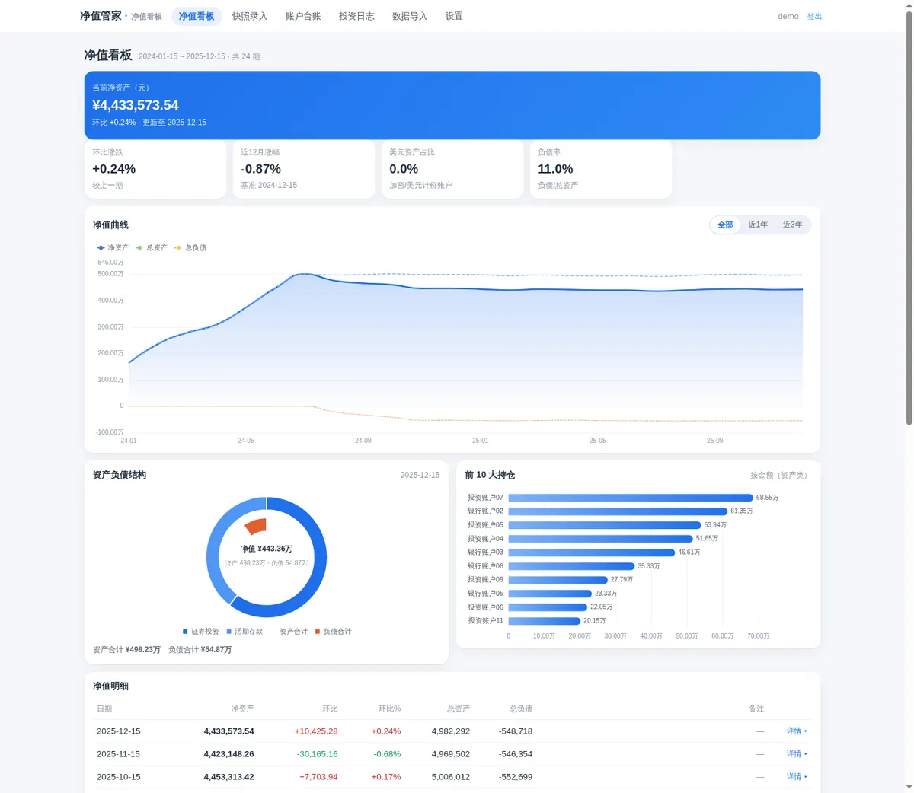
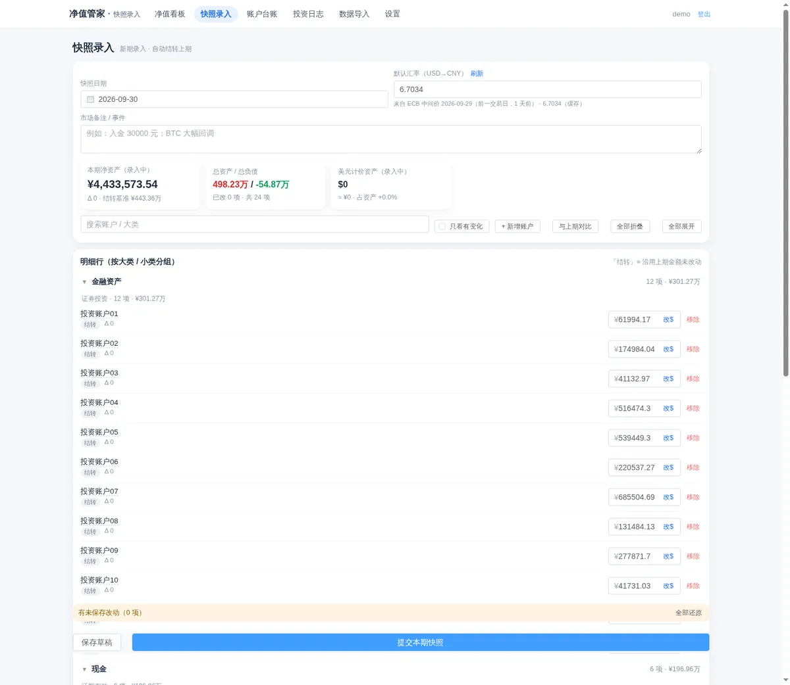
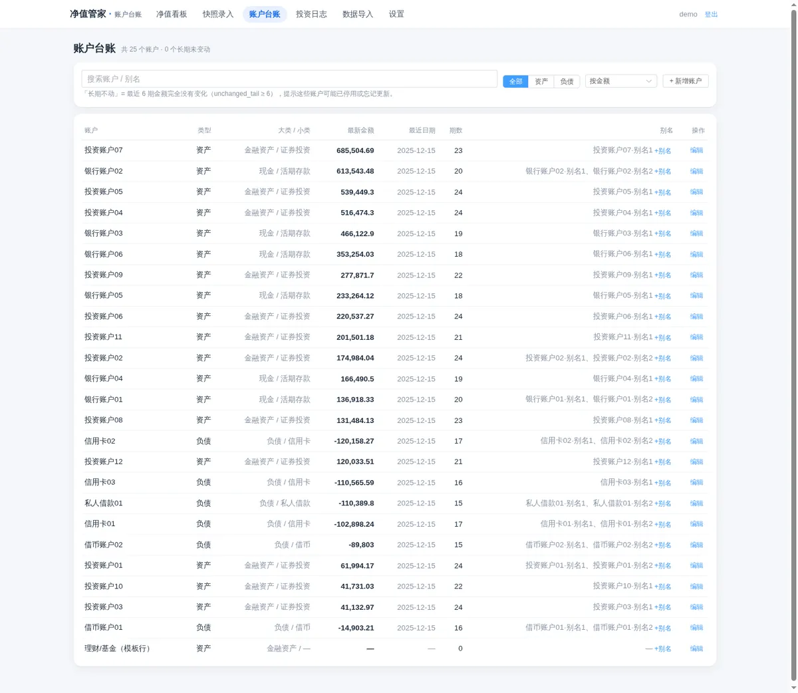
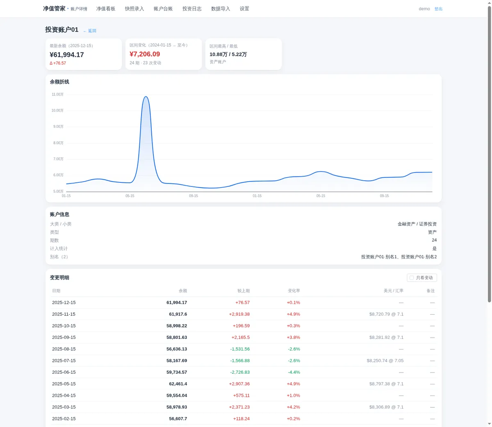
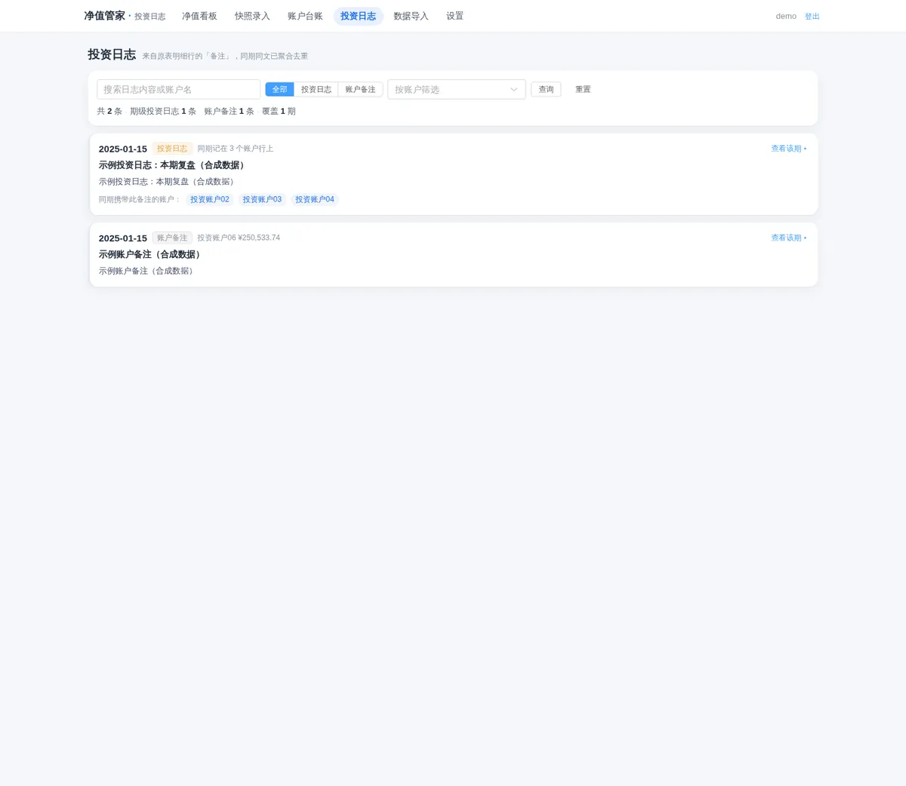
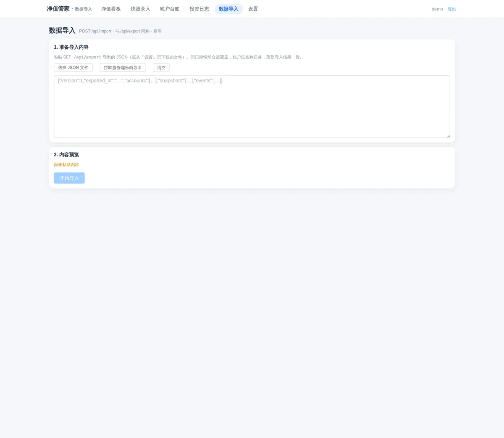
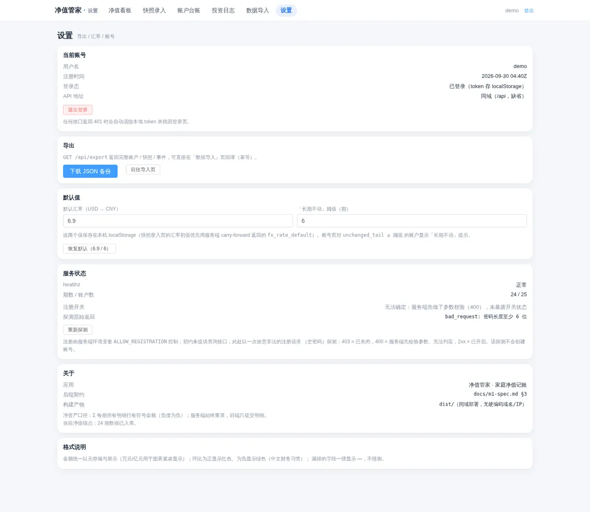
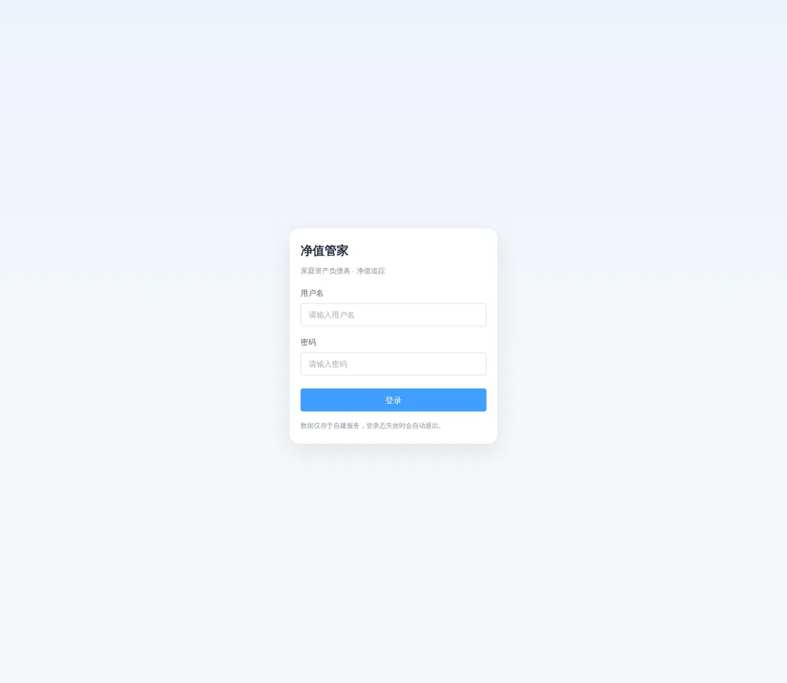

# 净值管家 networth

一个自用的「个人（家庭）资产负债表」记账服务：**每期只改动的行，系统负责结转与重算，
自动画出净值曲线、资产负债结构与逐期对账**。

- 后端：Python 3 标准库 + SQLite（**零第三方依赖**，不需要 pip install）
- 前端：Vue 3 + Vite + TypeScript + Pinia + Element Plus + ECharts
- 单用户登录（首个账号注册后自动关闭注册），数据全部保存在本地 SQLite

> **本仓库不包含任何数据。** 演示数据由 `tools/seed_demo.py` 在本地按固定随机种子生成，
> 只写入你自己的 SQLite；仓库里没有 `.json` 数据文件、没有 `.xlsx`、没有 `.db`。

## 目录

```
networth/
├─ backend/            # API 服务（标准库 + SQLite）
│  ├─ app/             #   config / store / domain / importer / fx / api / server
│  └─ tests/           #   unittest，真跑 HTTP 往返（数据来自 seed_demo）
├─ frontend/           # Vue 3 + Vite + TS + Pinia + Element Plus + ECharts
├─ tools/seed_demo.py  # 生成演示数据 + 创建演示账号（唯一的"数据来源"）
├─ scripts/xlsx_lite.py# 标准库 xlsx 读取（供自行编写 Excel 导入脚本复用）
├─ docs/m1-spec.md     # 接口契约与实施约定
└─ deploy/             # systemd unit、nginx vhost 模板、备份与发布脚本
```

## 功能一览

> 以下截图全部来自本仓库自带的演示数据（`tools/seed_demo.py` 生成），**不含任何真实财务信息**。

**净值看板** —— 当前净资产、环比 / 近 12 月涨幅 / 美元占比 / 负债率四张 KPI，
净值曲线（净资产 / 总资产 / 总负债）、资产负债结构环形图与前 10 大持仓。



**快照录入** —— 从上一期一键结转，只改需要改的行；小计与净资产由服务端重算，
偏离过大或符号异常的行只打标记待复核，不阻塞提交。



**账户台账** —— 账户与别名归一（同一账户的历史写法合并），分类 / 子类、
最近金额、出现期数、是否计入统计，支持新建 / 改名 / 加别名。



**账户详情** —— 单账户历史序列与逐期环比，快速看出某笔钱的变化轨迹。



**投资日志** —— 把明细行备注按「期 + 文本」聚合成**期级投资日志**（同期多账户引用的同一段文字去重）
与**账户备注**，支持按作用域 / 账户 / 关键词过滤。



**数据导入 / 导出** —— 导入自己的历史数据，或导出 JSON 备份（导出可原样导入还原）。



**设置** —— 汇率抓取、账户与分类维护、口令修改等。



**登录** —— 单用户登录；首个账号注册后自动关闭注册（需要时用 `ALLOW_REGISTRATION=1` 打开）。



## 计算口径

**净资产 = Σ 该期所有明细行的有符号 `amount_cny`**（负债块里的正号行照原样相加）。

- 原有的 `小计 / 资产总计 / 净资产` 汇总行一律**不信任**，服务端每次重算；
- 符号由账户的 `kind`（asset / liability）决定，不信任来源数据的正负号；
- 单行金额相对上期偏离过大或符号异常时，只打标记待复核，不阻塞提交。

## 快速开始

```bash
# 1) 生成演示数据 + 创建演示账号（口令会打印在终端）
cd backend
python3 ../tools/seed_demo.py --db data/networth.db
#    可选：--periods 24 --invest-accounts 12 --seed 20260101 --user demo --password 自定义

# 2) 起服务（默认 127.0.0.1:8972）
./run.sh                        # 或 NETWORTH_PORT=8972 python3 -m app.server

# 3) 前端
cd ../frontend
npm install                     # 或 NODE_MODULES_DIR=/path/to/node_modules bash scripts/build.sh
bash scripts/build.sh           # vue-tsc 类型检查 + vite build → dist/
```

打开页面用第 1 步打印的账号登录。首个账号创建后注册自动关闭
（需要再开注册时设置 `ALLOW_REGISTRATION=1`）。

## 导入你自己的数据

服务端只认一组 M0 风格的 JSON（`accounts.json` / `snapshots.json` / `reconcile.json`
/ `adjustments.json`，字段含义见 `backend/app/importer.py` 顶部注释与 `docs/m1-spec.md`）：

```bash
cd backend
python3 -m app.importer --source /path/to/data-out --db data/networth.db   # 幂等
python3 -m app.importer --source /path/to/data-out --db data/networth.db --reset  # 改名/拆分账户后重建
```

`scripts/xlsx_lite.py` 提供纯标准库的 xlsx 读取，可用来写自己的 Excel → JSON 转换脚本
（本仓库不附带任何针对特定表格的解析脚本，那部分与本项目使用者的原始表格强相关）。

## 测试

```bash
cd backend && /usr/bin/python3 -m unittest discover -s tests -v
```

测试在运行时用 `tools/seed_demo.py` 生成一份确定性合成数据集（含重复行、正号负债、
附加表、总览缺记录、用户确认修正等边界），所有断言都相对这份数据集做结构校验，
不依赖任何固定金额或真实数据。

## 部署

```bash
# 前端产物 → nginx 静态目录
WEB_ROOT=/var/www/networth bash deploy/deploy-web.sh

# API → systemd
sudo cp deploy/networth-api.service /etc/systemd/system/
sudo systemctl enable --now networth-api

# vhost（模板含 /api 反代与 SPA 回退；把 <DOMAIN> 等占位符替换掉）
sudo cp deploy/nginx.conf.template /etc/nginx/conf.d/networth.conf
sudo nginx -t && sudo nginx -s reload

# 每日备份（走 sqlite3 backup API，WAL 下安全）
sudo cp deploy/networth-backup.service deploy/networth-backup.timer /etc/systemd/system/
sudo systemctl enable --now networth-backup.timer
```

配置全部走环境变量（见 `backend/app/config.py`）：`NETWORTH_DB`、`NETWORTH_SECRET`、
`NETWORTH_PORT`、`NETWORTH_BIND`、`ALLOW_REGISTRATION`、`NETWORTH_WEB_DIST`。

## 运维注意

- **SQLite 是 WAL 模式**：运行中已提交的数据可能还在 `networth.db-wal` 里，直接
  `cp networth.db backup.db` 会复制到旧状态。请用 `python3 deploy/backup.py`（sqlite3
  backup API）；服务优雅退出时会执行 `PRAGMA wal_checkpoint(TRUNCATE)`，停服后的 `.db`
  是完整单文件。
- **`NETWORTH_SECRET` 不要更换**：口令哈希把该密钥当 pepper，密钥一变已有账号的密码
  就永久无法校验（没有找回入口）。库里 `meta.secret_fingerprint` 记录首次注册时的指纹，
  不一致时 `/api/healthz` 会返回 `"secret_mismatch": true` 并在日志里告警。
- **账户改名/拆分后必须 `--reset` 重新导入**：否则旧账户行会残留，账户数虚增。
- **投资日志来自明细备注**：同一期的同一段文字出现在多个账户行时，服务端按「期 + 文本」
  聚合去重，出现 ≥2 次判为**期级投资日志**，只出现 1 次判为**账户备注**（`/api/journal`）。
- **汇率**：`GET /api/fx?date=YYYY-MM-DD` 取该日 USD→CNY（主源 ECB 中间价，兜底 open.er-api），
  结果缓存到 `fx_rate` 表，`refresh=1` 强制重抓。**抓取失败返回 502，绝不返回编造值**；
  超出合理区间的返回值一律拒绝。周末/节假日取最近前一交易日并如实返回 `source_date` / `stale_days`。
- **历史汇率回填**：`cd backend && python3 -m app.fx_backfill`（默认只报告），`--apply`
  只补空缺期，已填写的值不动。

## License

MIT
